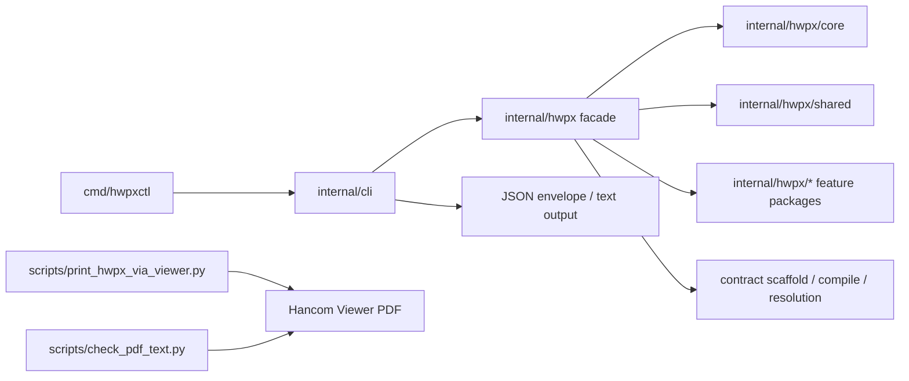
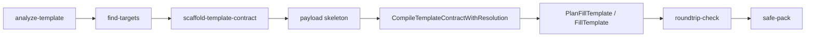
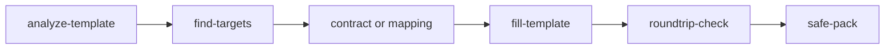
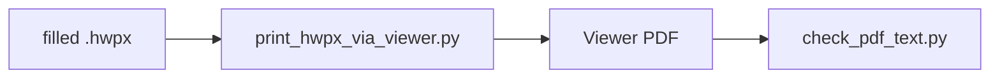

# HWPX CLI Architecture

## 한 줄 정의

`hwpxctl`는 범용 편집기가 아니라, **기존 HWPX 양식을 분석하고 안전하게 수정하는 CLI 기반 문서 변환 엔진**이다.

현재 구현은 완전한 `app/domain/infra` 분리는 아니지만, 실제 동작 기준으로 보면 아래 5개 층으로 이해하는 것이 가장 정확하다.

1. CLI orchestration
2. Public HWPX facade
3. Core analysis and validation
4. Shared mutation and patch application
5. Viewer-based verification scripts

## 아키텍처 방향

이 프로젝트는 다음 방향을 기준으로 정리한다.

- low-level XML surgery는 유지한다.
- 실제 제품 중심축은 `Template-First`다.
- `contract + payload` 흐름은 기존 planner와 applier 위에 얹는다.
- 최종 완료 기준은 구조 valid가 아니라 Viewer PDF 검증이다.

즉, 현재 목표는 “예쁘게 추상화된 문서 모델”보다 “원본을 최대한 보존하면서, 계약된 위치만 안정적으로 바꾸는 것”이다.

## 현재 구조

### 1. CLI layer

위치:

- [main.go](/Users/zarathu/projects/project-hwpx-cli/cmd/hwpxctl/main.go)
- [root.go](/Users/zarathu/projects/project-hwpx-cli/internal/cli/root.go)
- [package.go](/Users/zarathu/projects/project-hwpx-cli/internal/cli/package.go)
- 기타 `internal/cli/*.go`

역할:

- Cobra command 정의
- flag parsing
- JSON/text 출력 스키마 관리
- command error를 envelope로 변환
- 실제 서비스 호출 orchestration

원칙:

- 문서 수정 로직을 직접 가지지 않는다.
- 입력 해석, 흐름 제어, 출력 형식만 담당한다.

### 2. Public HWPX facade

위치:

- [hwpx.go](/Users/zarathu/projects/project-hwpx-cli/internal/hwpx/hwpx.go)
- [types.go](/Users/zarathu/projects/project-hwpx-cli/internal/hwpx/types.go)

역할:

- CLI가 의존하는 단일 진입점 제공
- `core`, `shared`, feature package를 묶어 외부에 노출
- 타입 alias와 service facade 역할 수행

이 층 덕분에 CLI는 내부 세부 패키지를 직접 모르고 `hwpx.*` 호출만 사용한다.

### 3. Core analysis and validation

위치:

- [core](/Users/zarathu/projects/project-hwpx-cli/internal/hwpx/core)

대표 책임:

- HWPX package read/write
- inspect / validate
- analyze-template
- find-targets
- roundtrip-check
- template contract load / validate / fingerprint verify

이 층은 “문서를 어떻게 읽고 해석할지”에 가깝다.  
문서 구조를 파악하고 위험 신호를 계산하는 역할이 중심이다.

### 4. Shared mutation and patch application

위치:

- [shared](/Users/zarathu/projects/project-hwpx-cli/internal/hwpx/shared)

대표 책임:

- `remove-guides`
- `PlanFillTemplate`
- `FillTemplate`
- low-level XML mutation 보조 로직
- patch planning과 apply 결과 생성

이 층은 현재 사실상의 편집 엔진이다.  
좌표, selector, replacement를 실제 XML 변경으로 바꾸는 핵심 경로가 여기에 모여 있다.

### 5. Feature packages

위치:

- [paragraph](/Users/zarathu/projects/project-hwpx-cli/internal/hwpx/paragraph)
- [table](/Users/zarathu/projects/project-hwpx-cli/internal/hwpx/table)
- [section](/Users/zarathu/projects/project-hwpx-cli/internal/hwpx/section)
- [object](/Users/zarathu/projects/project-hwpx-cli/internal/hwpx/object)
- [layout](/Users/zarathu/projects/project-hwpx-cli/internal/hwpx/layout)
- [media](/Users/zarathu/projects/project-hwpx-cli/internal/hwpx/media)
- 그 외 하위 패키지

역할:

- low-level 편집 명령별 기능 구현
- 문단, 표, 섹션, 개체, 참조 등 도메인별 XML 조작 제공

현재는 완전히 독립적인 domain layer라기보다, CLI 명령을 뒷받침하는 기능별 구현 모듈에 가깝다.

## Template-First 실행 흐름

현재 제품에서 가장 중요한 흐름이다.

### 분석 단계

- `analyze-template`는 section, paragraph, table, placeholder, guide를 요약한다.
- fingerprint 후보를 만든다.
- `find-targets`는 anchor, table label, placeholder 기준으로 실제 수정 대상을 찾는다.

### 계약 단계

- contract는 [contract.go](/Users/zarathu/projects/project-hwpx-cli/internal/hwpx/core/contract.go)에서 정의된다.
- contract는 `templateId`, `templateVersion`, `fingerprint`, `fields`, `tables`, `strict`를 가진다.
- scaffold는 [contract_scaffold.go](/Users/zarathu/projects/project-hwpx-cli/internal/hwpx/contract_scaffold.go)에서 생성된다.

### 컴파일 단계

- `contract + payload`는 곧바로 문서를 수정하지 않는다.
- 먼저 [contract_compile.go](/Users/zarathu/projects/project-hwpx-cli/internal/hwpx/contract_compile.go)에서 기존 `FillTemplateReplacement` 집합으로 컴파일된다.
- 이 과정에서 resolution report가 같이 만들어진다.

### 적용 단계

- planner는 어떤 selector가 어떤 실제 위치와 매칭됐는지 계산한다.
- applier는 XML을 직접 수정한다.
- 결과는 `changes`, `misses`, `resolution`으로 정리된다.

## Resolution and traceability

현재 구조의 중요한 특징은 “바꿨다”에서 끝나지 않는다는 점이다.

위치:

- [fill_template_resolution.go](/Users/zarathu/projects/project-hwpx-cli/internal/hwpx/fill_template_resolution.go)
- [shared/types.go](/Users/zarathu/projects/project-hwpx-cli/internal/hwpx/shared/types.go)
- [shared/fill.go](/Users/zarathu/projects/project-hwpx-cli/internal/hwpx/shared/fill.go)

역할:

- mapping/contract 입력을 같은 `resolution` 모델로 정규화
- 각 resolution entry가 어떤 `change` 또는 `miss`로 이어졌는지 correlation 제공
- dry-run과 apply 결과를 같은 관점으로 비교 가능하게 함

이건 이후 `preview-diff`, diagnostics, AI 후속 수정 판단의 기반이 된다.

## 검증 구조

실사용 CLI 흐름과 내부 검증 흐름은 분리해서 보는 것이 맞다.

### 사용자 관점

### 개발/검증 관점

관련 스크립트:

- [print_hwpx_via_viewer.py](/Users/zarathu/projects/project-hwpx-cli/scripts/print_hwpx_via_viewer.py)
- [check_pdf_text.py](/Users/zarathu/projects/project-hwpx-cli/scripts/check_pdf_text.py)
- [test_contract_example_flow.py](/Users/zarathu/projects/project-hwpx-cli/scripts/test_contract_example_flow.py)

현재는 이 검증 계층이 CLI 내부가 아니라 script 기반 외부 harness에 있다.  
이건 macOS Hancom Viewer 의존성 때문에 의도된 분리다.

## 현재 구조의 장점

- low-level 편집 기능을 유지하면서도 high-level flow를 얹을 수 있다.
- `--mapping`과 `--template --payload`가 같은 planner/applier를 재사용한다.
- CLI 출력이 machine-readable envelope로 정리되어 후속 자동화에 유리하다.
- Viewer 검증이 코드 경로와 분리돼 있어서 CI 불가 환경과 로컬 검증을 나눌 수 있다.

## 현재 구조의 한계

### `app/domain/infra`가 아직 아니다

아키텍처 제안서 방향과 달리, 지금은 `internal/app`, `domain/template`, `domain/patch` 같은 분리가 없다.  
실제 편집 로직은 아직 [shared](/Users/zarathu/projects/project-hwpx-cli/internal/hwpx/shared) 쪽에 많이 모여 있다.

### analysis / planning / apply 경계가 완전히 분리되진 않았다

현재는 기능적으로는 나뉘어 있지만, 패키지 경계가 명확하게 독립적이진 않다.

### create-first 계층이 비어 있다

현재 구조는 거의 전부 template-first를 향하고 있다.  
create-first는 low-level primitive는 있지만, high-level compose 계층은 아직 없다.

## 앞으로의 정리 방향

지금 당장은 대규모 리팩터링보다, 현재 흐름 위에 의미 있는 계층을 더 명확히 올리는 편이 맞다.

### 1. 유지할 것

- `internal/cli` orchestration 구조
- `internal/hwpx` facade
- `core`와 `shared`의 큰 책임 분리
- contract compile -> planner -> apply 흐름

### 2. 점진적으로 분리할 것

- contract schema / compile / scaffold를 별도 template module로 응집
- planner / applier / diff를 patch module로 정리
- `preview-diff`와 verification helper를 검증 계층으로 정리

### 3. 나중에 도입할 것

- `app/domain/infra` 식 디렉터리 재구성
- create-first compose 전용 계층
- object/layout/header/footer까지 포함한 section-aware 통합 모델

## 요약

현재 프로젝트의 실제 아키텍처는 **CLI + facade + core analysis + shared mutation + external verification harness** 구조다.

이 구조는 제안서의 이상형과 완전히 같지는 않지만, 방향은 맞다.  
특히 `Template-driven transformer`, `contract-first`, `patch planning`, `Viewer-based verification`이라는 핵심 축은 이미 현재 구현에 반영돼 있다.

다만 아직은 “정리된 최종 구조”가 아니라 “현재 기능을 우선 확보한 뒤, 그 위에 점진적으로 구조를 정돈하는 상태”로 보는 것이 정확하다.
