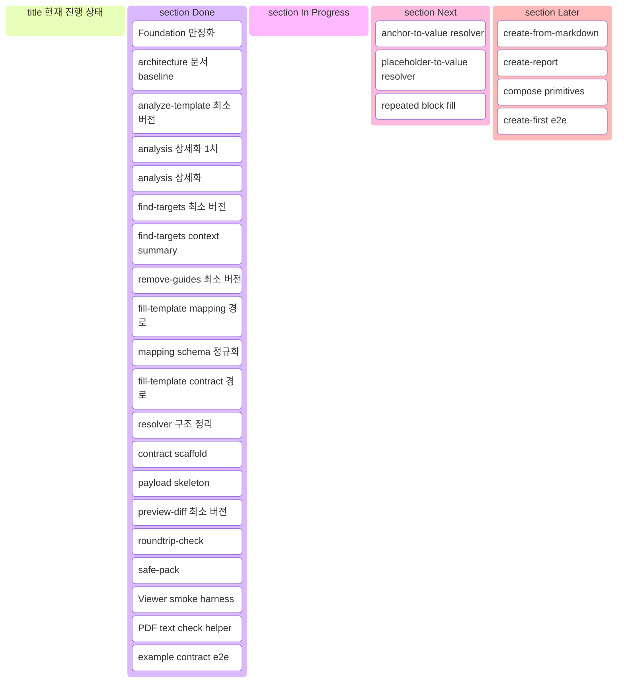
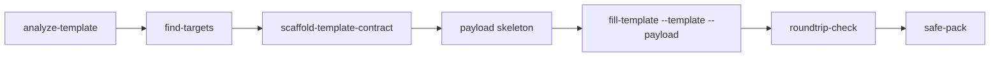

# HWPX CLI Progress

## 요약

현재 개발의 중심은 `Template-First` 최소 제품 완성이다.  
실제 example `.hwpx` 기준으로 `contract scaffold -> payload -> fill-template -> Viewer PDF`까지 end-to-end 검증이 이어진 상태다.

## 운영 규칙

- 개발 현황과 칸반은 이 문서에서 관리한다.
- 기능 작업이 끝날 때마다 `최근 완료`, `Kanban`, `다음 작업 추천`을 같이 갱신한다.
- 방향과 단계 정의는 [roadmap.md](./roadmap.md)에서 관리한다.

## 현재 상태

| Track | 상태 | 메모 |
| --- | --- | --- |
| Foundation | 높음 | lock, atomic write, `validate.renderSafe`, `safe-pack` 최소 버전 완료 |
| Analysis / Discovery | 높음 | `analyze-template`, `find-targets`, context summary, analysis 상세화 완료 |
| Template Contract | 높음 | contract scaffold, payload skeleton, contract fill 경로, resolver 정리 완료 |
| Verification | 높음 | `preview-diff`, `roundtrip-check`, Viewer smoke harness, PDF text check 완료 |
| Create-First | 낮음 | 아직 본격 시작 전 |

## Kanban

## 실제 되는 흐름

검증용 내부 플로우에서는 필요 시 `Viewer PDF print -> check_pdf_text.py`까지 이어서 확인한다.

## 최근 완료

- analysis 상세화 완료
- mapping schema 정규화
- analyze-template section/table detail 강화
- fill-template input resolver 구조 정리
- preview-diff 최소 버전 추가
- 현재 코드 기준 architecture 문서 정리
- contract scaffold generator 최소 버전
- payload skeleton 생성
- contract flow resolution report
- scaffold fingerprint 정제
- example 기반 Viewer PDF e2e harness
- PDF text compare helper 분리

## 다음 작업 추천

1. anchor-to-value resolver
2. placeholder-to-value resolver
3. repeated block fill

## 참고

- 이 문서는 현재 코드 기준 진행 상태를 요약한다.
- 상세 체크 항목은 [roadmap.md](./roadmap.md) 기준으로 관리한다.
